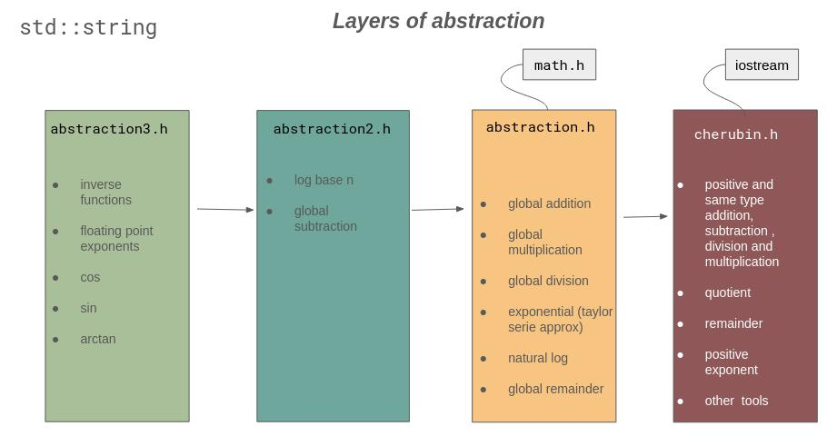

<body>

<i><b>README</b></i>
 

<a><i>Table Of Contents</i></a>  <ul>
<b><li style="margin-left:20px; color: #2c4786;">Addition</li></b>
<a href="#addabstraction" style="margin-left:40px;">addabstraction</a>
 
<b><li style="margin-left:40px; color: #2c4786;">Integers</li></b>
<a href="#addint" style="margin-left:60px;">addint</a>
 
<b><li style="margin-left:40px; color: #2c4786;">Floating points</li></b>
<a href="#addflt" style="margin-left:60px;">addflt</a>
 
<a href="#addflt2" style="margin-left:60px;">addflt2</a>
 
<b><li style="margin-left:20px; color: #2c4786;">Substraction</li></b>
<a href="#subsabstraction" style="margin-left:40px;">subsabstraction</a>
 
<b><li style="margin-left:40px; color: #2c4786;">Integers</li></b>
<a href="#subsint" style="margin-left:60px;">subsint</a>
 
<b><li style="margin-left:40px; color: #2c4786;">Floating points</li></b>
<a href="#subsflt" style="margin-left:60px;">subsflt</a>
 
<b><li style="margin-left:20px; color: #2c4786;">Multiplication</li></b>
<a href="#multabstraction" style="margin-left:40px;">multabstraction</a>
 
<b><li style="margin-left:40px; color: #2c4786;">Integers</li></b>
<a href="#multint" style="margin-left:60px;">multint</a>
 
<a href="#multint2" style="margin-left:60px;">multint2</a>
 
<b><li style="margin-left:40px; color: #2c4786;">Floating points</li></b>
<a href="#multflt" style="margin-left:60px;">multflt</a>
 
<a href="#multflt2" style="margin-left:60px;">multflt2</a>
 
<a href="#multbase10" style="margin-left:60px;">multbase10</a>
 
<b><li style="margin-left:20px; color: #2c4786;">Division</li></b>
<a href="#divideabstraction" style="margin-left:40px;">divideabstraction</a>
 
<a href="#divide2" style="margin-left:40px;">divide2</a>
 
<a href="#divide" style="margin-left:40px;">divide</a>
 
<a href="#dividebase10" style="margin-left:40px;">dividebase10</a>
 
<a href="#dividebase10_2" style="margin-left:40px;">dividebase10_2</a>
 
<b><li style="margin-left:40px; color: #2c4786;">Remainder</li></b>
<b><li style="margin-left:60px; color: #2c4786;">Integers</li></b>
<a href="#remainderint" style="margin-left:80px;">remainderint</a>
 
<b><li style="margin-left:60px; color: #2c4786;">Floating Points</li></b>
<a href="#remainderflt" style="margin-left:80px;">remainderflt</a>
 
<b><li style="margin-left:40px; color: #2c4786;">Quotient</li></b>
<b><li style="margin-left:60px; color: #2c4786;">Integers</li></b>
<a href="#quotientint" style="margin-left:80px;">quotientint</a>
 
<b><li style="margin-left:60px; color: #2c4786;">Floating points</li></b>
<a href="#quotientflt" style="margin-left:80px;">quotientflt</a>
 
<b><li style="margin-left:20px; color: #2c4786;">Power</li></b>
<b><li style="margin-left:40px; color: #2c4786;">Integers</li></b>
<a href="#powerint3" style="margin-left:60px;">powerint3</a>
 
<a href="#poweroddn" style="margin-left:60px;">poweroddn</a>
 
<b><li style="margin-left:40px; color: #2c4786;">Floating points</li></b>
<a href="#powerflt" style="margin-left:60px;">powerflt</a>
 
<b><li style="margin-left:20px; color: #2c4786;">Exponential</li></b>
<a href="#chexp1" style="margin-left:40px;">chexp1</a>
 
<a href="#chexp2" style="margin-left:40px;">chexp2</a>
 
<a href="#chexp3" style="margin-left:40px;">chexp3</a>
 
<b><li style="margin-left:20px; color: #2c4786;">Logarithms</li></b>
<a href="#chlognatural1" style="margin-left:40px;">chlognatural1</a>
 
<b><li style="margin-left:40px; color: #2c4786;">Base n</li></b>
<a href="#chlogn" style="margin-left:60px;">chlogn</a>
 
<a href="#chlognabstraction" style="margin-left:60px;">chlognabstraction</a>
 
<a href="#chlognaturalabstraction" style="margin-left:60px;">chlognaturalabstraction</a>
 
<b><li style="margin-left:20px; color: #2c4786;">Factorial</li></b>
<a href="#factorial" style="margin-left:40px;">factorial</a>
 
<b><li style="margin-left:20px; color: #2c4786;">Trigonometry</li></b>
<a href="#chcos" style="margin-left:40px;">chcos</a>
 
<a href="#chsin " style="margin-left:40px;">chsin </a>
 
<a href="#chtan" style="margin-left:40px;">chtan</a>
 
<a href="#chacos" style="margin-left:40px;">chacos</a>
 
<a href="#chasin" style="margin-left:40px;">chasin</a>
 
<a href="#chatan" style="margin-left:40px;">chatan</a>
 
<b><li style="margin-left:20px; color: #2c4786;">Inverse functions</li></b>
<a href="#inverse" style="margin-left:40px;">inverse</a>
 
<b><li style="margin-left:20px; color: #2c4786;">Comparisons</li></b>
<a href="#is_greater" style="margin-left:40px;">is_greater</a>
 
<a href="#is_greaterflt" style="margin-left:40px;">is_greaterflt</a>
 
<b><li style="margin-left:20px; color: #2c4786;">Round</li></b>
<a href="#roundstr" style="margin-left:40px;">roundstr</a>
 
<b><li style="margin-left:20px; color: #2c4786;">Other Tools</li></b>
<a href="#rmzero" style="margin-left:40px;">rmzero</a>
 
<a href="#intpart" style="margin-left:40px;">intpart</a>
 
<a href="#fltpart" style="margin-left:40px;">fltpart</a>
 
<a href="#is_decimal" style="margin-left:40px;">is_decimal</a>
 
<a href="#centerizer" style="margin-left:40px;">centerizer</a>
 
<a href="#chabs" style="margin-left:40px;">chabs</a>
 
<a href="#is_zero" style="margin-left:40px;">is_zero</a>
 
</ul> 

<h3>#Description</h3>

This library if for very large and precise number (integers or floating points) manipulation those who can not be stored in an other datatype than <code>std::string</code> or <code>std::deque</code>. The only limit is the system memory.

 
  
 <h1 style="color:#2c4786;">Addition</h1>
<h2 id="addabstraction" style="test-align: left;">addabstraction</h2>
<h3>#Usage</h3>

<code>std::string addabstraction(std::string x, std::string x2)</code>

Returns the result of any addition between positive and/or negative values. Handles the abstraction for <code>addflt</code> function that normally does not accept negative value.

<h3>#Arguments</h3>
<table><tr><th>Name</th><th>Definition</th></tr><tr><th>
x </th><th> the first number (int or float as std string)</th></tr>
<tr><th>x2 </th><th> the second number (int or float as std string)</th></tr>
</table>
 
<h3>#Example(s)</h3>

<code></code>
 <code>std::string x = "0.5";</code>
 <code>std::string x2 = "2.5";</code>
 <code>addabstraction(x, x2);</code>
 <code>"3.0"</code>
 <code>x2 = "-2.5";</code>
 <code>addabstraction(x, x2);</code>
 <code>"-2.0" </code>
 <code></code>

 

<h2 style="color:#2c4786;">Integers</h2>
<h2 id="addint" style="test-align: left;">addint</h2>
<h3>#Usage</h3>

<code>std::string addint(std::string &x, std::string &x2)</code>

<h3>#Description</h3>

Returns the result as a std string.

<h3>#Arguments</h3>
<table><tr><th>Name</th><th>Definition</th></tr><tr><th>
x </th><th> is the first positive int as a string</th></tr>
<tr><th>x2 is the second positive int as a string</th></tr>
</table>
 
<h3>#Example(s)</h3>

<code>std::string a = "4";</code>
 <code>std::string b = "112";</code>
 <code>addint(a, b);</code>
 <code>"116"</code>
 <code></code>
 <code>x = "1458970";</code>
 <code>x2 = "563489287";</code>
 <code>addint(x, x2);</code>
 <code>"564948257"</code>

 

<h2 style="color:#2c4786;">Floating points</h2>
<h2 id="addflt" style="test-align: left;">addflt</h2>
<h3>#Usage</h3>

<code>std::string addflt(std::string &x, std::string &x2)</code>

<h3>#Description</h3>

Returns the addition of two floating points as a std string. Accepts integers, but if you plan to add integers, <code>addint</code> is preferable to use.

<h3>#Arguments</h3>
<table><tr><th>Name</th><th>Definition</th></tr><tr><th>
x </th><th> is one of the int or float that will be part of the addition operation </th></tr>
<tr><th>x2 </th><th> is one of the int or float that will be part of the addition operation</th></tr>
</table>
 
<h3>#Example(s)</h3>

<code></code>
 <code>std::string x = "14589.70";</code>
 <code>std::string x2 = "5634.89287";</code>
 <code>adflt(x, x2);</code>
 <code>"20224.59287"</code>
 <code></code>

 

<h2 id="addflt2" style="test-align: left;">addflt2</h2>
<h3>#Usage</h3>

<code>std::string addflt(std::string x, std::string x2)</code>

<h3>#Description</h3>

Same as <code>addflt</code> with another algorithm.

<h3>#Arguments</h3>
<table><tr><th>Name</th><th>Definition</th></tr><tr><th>
x </th><th> is one of the int or float that will be part of the addition operation </th></tr>
<tr><th>x2 </th><th> is one of the int or float that will be part of the addition operation </th></tr>
</table>
 
<h3>#Example(s)</h3>

<code></code>
 <code>std::string x = "14589.70";</code>
 <code>std::string x2 = "5634.89287";</code>
 <code>adflt2(x, x2);</code>
 <code>"20224.59287"</code>
 <code></code>

 

<h1 style="color:#2c4786;">Substraction</h1>
<h2 id="subsabstraction" style="test-align: left;">subsabstraction</h2>
<h3>#Usage</h3>

<code>std::string subsabstraction(std::string x, std::string x2)</code>

<h3>#Description</h3>

Returns the result of a substraction. Handles the abstraction needed for <code>subsflt</code> function  that normally does not accept negative inputs. 

<h3>#Arguments</h3>
<table><tr><th>Name</th><th>Definition</th></tr><tr><th>
x </th><th> is the number that will be substracted (int or float as std string)</th></tr>
<tr><th>x2 </th><th> is the number that will substract <code>x</code></th></tr>
</table>
 
<h3>#Example(s)</h3>

<code></code>
 <code>std::string x = "-5687.58";</code>
 <code>std::string x2 = "-459372";</code>
 <code>subsabstraction(x2, x);</code>
 <code>"-465059.58"</code>
 <code></code>

 

<h2 style="color:#2c4786;">Integers</h2>
<h2 id="subsint" style="test-align: left;">subsint</h2>
<h3>#Usage</h3>

<code>std::string subsint(std::string &x, std::string &x2)</code>

<h3>#Description</h3>

Returns the result as a std string.

<h3>#Arguments</h3>
<table><tr><th>Name</th><th>Definition</th></tr><tr><th>
x </th><th> is the first positive int as a string, must be greater or equal to to x2</th></tr>
<tr><th>x2 is the second positive int as a string, must be lower or equal to x</th></tr>
</table>
 
<h3>#Example(s)</h3>

<code></code>
 <code>std::string x = "1458970";</code>
 <code>std::string x2 = "563489287";</code>
 <code>subsint(x2, x);</code>
 <code>"562030317"</code>
 <code></code>

 

<h2 style="color:#2c4786;">Floating points</h2>
<h2 id="subsflt" style="test-align: left;">subsflt</h2>
<h3>#Usage</h3>

<code>std::string subsflt(std::string &x, std::string &x2) </code>

<h3>#Description</h3>

Returns the substraction of two floating point numbers. Accepts integers, but if you plan to substract integers, it is preferable to use <code>subsint</code> function.

<h3>#Arguments</h3>
<table><tr><th>Name</th><th>Definition</th></tr><tr><th>
x </th><th> is a number represented as a string, must be higher or equal to the second number </th></tr>
<tr><th>x2 </th><th> is a number represented as a string, must be lower or equal to the second number </th></tr>
</table>
 
<h3>#Example(s)</h3>

<code></code>
 <code>std::string x = "14589.70";</code>
 <code>std::string x2 = "56348.9287";</code>
 <code>subsflt(x2, x) ;</code>
 <code>"41759.2287" </code>
 <code></code>

 

<h1 style="color:#2c4786;">Multiplication</h1>
<h2 id="multabstraction" style="test-align: left;">multabstraction</h2>
<h3>#Usage</h3>

<code>std::string multabstraction(std::string x, std::string x2)</code>

<h3>#Description</h3>

Returns the result of a multiplication. Handles the abstraction for <code>multflt2</code> that normaly does not accept negative values.

<h3>#Arguments</h3>
<table><tr><th>Name</th><th>Definition</th></tr><tr><th>
x </th><th> is the first number (int or float as std string)</th></tr>
<tr><th>x2 </th><th> is the second number (int or float as std string)</th></tr>
</table>
 
<h3>#Example(s)</h3>

<code></code>
 <code>std::string x = "-569.87";</code>
 <code>std::string x2 = "459372";</code>
 <code>multabstraction(x, x2);</code>
 <code>"-261782321.640"</code>
 <code></code>

 

<h2 style="color:#2c4786;">Integers</h2>
<h2 id="multint" style="test-align: left;">multint</h2>
<h3>#Usage</h3>

<code>std::string multint(std::string &x, unsigned int &x2)</code>

<h3>#Description</h3>

Returns the multiplication of two integers as std string.

<h3>#Arguments</h3>
<table><tr><th>Name</th><th>Definition</th></tr><tr><th>
x </th><th> is an integer higher than 0 as a std string</th></tr>
<tr><th>x2 </th><th> is an unsigned integer higher than 0 </th></tr>
</table>
 
<h3>#Example(s)</h3>

<code></code>
 <code>std::string x = "1458970";</code>
 <code>unsigned int x2b = 45;</code>
 <code>multint(x, x2);</code>
 <code>"65653650"</code>
 <code></code>

 

<h2 id="multint2" style="test-align: left;">multint2</h2>
<h3>#Usage</h3>

<code>std::string multint2(std::string &x, std::string &x2)</code>

<h3>#Description</h3>

Returns the multiplication of two integers as std string.

<h3>#Arguments</h3>
<table><tr><th>Name</th><th>Definition</th></tr><tr><th>
x </th><th> is an integer higher tha 0 as a std string</th></tr>
<tr><th>x2 </th><th> is an integer higher than 0 as a std string</th></tr>
</table>
 
<h3>#Example(s)</h3>

<code></code>
 <code>std::string x = "1458970";</code>
 <code>std::string x2 = "563489287";</code>
 <code>multint2(x, x2);</code>
 <code>"822113965054390"</code>
 <code></code>

 

<h2 style="color:#2c4786;">Floating points</h2>
<h2 id="multflt" style="test-align: left;">multflt</h2>
<h3>#Usage</h3>

<code>std::string multflt(std::string &x, std::string &x2)</code>

<h3>#Description</h3>

Returns the result of a multpilication as a std string from floating points or integers as std string.

<h3>#Arguments</h3>
<table><tr><th>Name</th><th>Definition</th></tr><tr><th>
x </th><th> is a floating points or integer as a std string</th></tr>
<tr><th>x2 </th><th> is a floating points or integer as a std string</th></tr>
</table>
 
<h3>#Example(s)</h3>

<code></code>
 <code>std::string x = "1458.970";</code>
 <code>std::string x2 = "563489.287";</code>
 <code>multflt(x, x2);</code>
 <code>"822113965.054390"</code>
 <code></code>

 

<h2 id="multflt2" style="test-align: left;">multflt2</h2>
<h3>#Usage</h3>

<code>std::string multflt2(std::string &x, std::string &x2)</code>

<h3>#Description</h3>

Same as <code>multflt</code>, but with another algorithm.

<h3>#Arguments</h3>
<table><tr><th>Name</th><th>Definition</th></tr><tr><th>
x </th><th> is a floating points or integer as a std string</th></tr>
<tr><th>x2 </th><th> is a floating points or integer as a std string</th></tr>
</table>
 
<h3>#Example(s)</h3>

<code></code>
 <code>std::string x = "1458.970";</code>
 <code>std::string x2 = "563489.287";</code>
 <code>multflt2(x, x2);</code>
 <code>"822113965.05439000000"</code>
 <code></code>

 

<h2 id="multbase10" style="test-align: left;">multbase10</h2>
<h3>#Usage</h3>

<code>std::string multbase10(std::string x, unsigned int base = 9)</code>

<h3>#Arguments</h3>
<table><tr><th>Name</th><th>Definition</th></tr><tr><th>
x </th><th> is the int of float that will be multiplied, as a std string</th></tr>
<tr><th>base </th><th> is the number of 0 of the base 10 multiplicator</th></tr>
</table>
 
<h3>#Example(s)</h3>

<code></code>
 <code>std::string x = "1458.970";</code>
 <code>multbase10(x);</code>
 <code>"1458970000000.0"</code>
 <code></code>

 

<h1 style="color:#2c4786;">Division</h1>
<h2 id="divideabstraction" style="test-align: left;">divideabstraction</h2>
<h3>#Usage</h3>

<code>std::string divideabstraction(std::string x, std::string x2, unsigned int nb_decimal = 5)</code>

<h3>#Description</h3>

Returns the result of a division. Handles the abstraction for <code>divide2</code> that normaly does not accept negative values.

<h3>#Arguments</h3>
<table><tr><th>Name</th><th>Definition</th></tr><tr><th>
x </th><th> is the first number (int or float as std string)</th></tr>
<tr><th>x2 </th><th> is the second number (int or float as std string)</th></tr>
<tr><th>nb_decimal </th><th> is the number of decimal to keep</th></tr>
</table>
 
<h3>#Example(s)</h3>

<code></code>
 <code>std::string x = "-569.87";</code>
 <code>std::string x2 = "459372";</code>
 <code>divideabstraction(x, x2);</code>
 <code>"-0.001240541"</code>
 <code></code>

 

<h2 id="divide2" style="test-align: left;">divide2</h2>
<h3>#Usage</h3>

<code>std::string divide2(std::string &x, std::string &x2, unsigned int nb_decimal = 8)</code>

<h3>#Description</h3>

Returns the result of a division between ints or floats represented as std string.

<h3>#Arguments</h3>
<table><tr><th>Name</th><th>Definition</th></tr><tr><th>
x </th><th> is a int or float that will be divided represented as a std string, must be superior or equal to 1, refer to <code href="centerizer">centerizer()</code> to center your division to make the divided equal to 1 or higher</th></tr>
<tr><th>x2 </th><th> is a int or float that will divide represented as a std string</th></tr>
<tr><th>nb_decimal </th><th> is an int representing the number of decimal to keep as a result</th></tr>
</table>
 
<h3>#Example(s)</h3>

<code></code>
 <code>std::string x = "1458.970";</code>
 <code>std::string x2 = "563489.287";</code>
 <code>divide2(x2, x);</code>
 <code>"386.22400"</code>
 <code></code>

 

<h2 id="divide" style="test-align: left;">divide</h2>
<h3>#Usage</h3>

<code>std::string divide(std::string &x, std::string &x2, unsigned int nb_decimal = 8)</code>

<h3>#Description</h3>

!!Obsolete!! Returns the result of a division between ints or floats represented as std string.

<h3>#Arguments</h3>
<table><tr><th>Name</th><th>Definition</th></tr><tr><th>
x </th><th> is a int or float that will be divided represented as a std string, must be superior or equal to 1, refer to <code href="centerizer">centerizer()</code> to center your division to make the divided equal to 1 or higher</th></tr>
<tr><th>x2 </th><th> is a int or float that will divide represented as a std string</th></tr>
</table>
 
<h3>#Example(s)</h3>

<code></code>
 <code>std::string x = "1458.970";</code>
 <code>std::string x2 = "563489.287";</code>
 <code>divide(x2, x);</code>
 <code>"386.2240" </code>
 <code></code>

 

<h2 id="dividebase10" style="test-align: left;">dividebase10</h2>
<h3>#Usage</h3>

<code>std::string dividebase10(std::string &x, unsigned int accuracy = 9)</code>

<h3>#Description</h3>

Returns the result of a division base 10.

<h3>#Arguments</h3>
<table><tr><th>Name</th><th>Definition</th></tr><tr><th>
x </th><th> is the int or float that will be divided, as a std string</th></tr>
<tr><th>base </th><th> is the number of 0 of the base 10 multiplicator</th></tr>
</table>
 
<h3>#Example(s)</h3>

<code></code>
 <code>std::string x2 = "563489.287";</code>
 <code>dividebase10(x2);</code>
 <code>"0.000563489287"</code>
 <code></code>

 

<h2 id="dividebase10_2" style="test-align: left;">dividebase10_2</h2>
<h3>#Usage</h3>

<code>std::string dividebase10_2(std::string x, int divider = 9)</code>

<h3>#Description</h3>

Returns the result of an int or float (as a std string) divided by a base 10 divider.

<h3>#Arguments</h3>
<table><tr><th>Name</th><th>Definition</th></tr><tr><th>
x </th><th> is the int of float that will be divided</th></tr>
<tr><th>divider </th><th> is an int that indicates the number of zero of the base 10 divider</th></tr>
</table>
 
<h3>#Example(s)</h3>

<code></code>
 <code>std::string x2 = "563489.287";</code>
 <code>dividebase10_2(x2);</code>
 <code>"0.000563489287"</code>
 <code></code>

 

<h2 style="color:#2c4786;">Remainder</h2>
<h3 style="color:#2c4786;">Integers</h3>
<h2 id="remainderint" style="test-align: left;">remainderint</h2>
<h3>#Usage</h3>

<code>std::string remainderint(std::string &x, std::string &x2)</code>

<h3>#Description</h3>

Returns the remainder of a division between two int represented as a std string

<h3>#Arguments</h3>
<table><tr><th>Name</th><th>Definition</th></tr><tr><th>
x </th><th> is the int that will be divided, represented as a string, must be greater or equal to x2</th></tr>
<tr><th>x2 </th><th> is the divider which is a int represented as a string, must be lower or equal to x</th></tr>
</table>
 
<h3>#Example(s)</h3>

<code></code>
 <code>std::string x = "1458970";</code>
 <code>std::string x2 = "563489287";</code>
 <code>remainderint(x2, x);</code>
 <code>"326867"</code>
 <code></code>

 

<h3 style="color:#2c4786;">Floating Points</h3>
<h2 id="remainderflt" style="test-align: left;">remainderflt</h2>
<h3>#Usage</h3>

<code>std::string remainderflt(std::string &x, std::string &x2)</code>

<h3>#Description</h3>

Returns the remainder of a division between two int or floating point represented as a std string

<h3>#Arguments</h3>
<table><tr><th>Name</th><th>Definition</th></tr><tr><th>
x </th><th> is the floating point or int that will be divided, represented as a string, must be greater or equal to x2</th></tr>
<tr><th>x2 </th><th> is the divider which is a floating point or int represented as a string, must be lower or equal to x</th></tr>
</table>
 
<h3>#Example(s)</h3>

<code></code>
 <code>std::string x = "14589.70";</code>
 <code>std::string x2 = "56348.9287";</code>
 <code>remainderflt(x2, x);</code>
 <code>"12579.8287"</code>
 <code></code>

 

<h2 style="color:#2c4786;">Quotient</h2>
<h3 style="color:#2c4786;">Integers</h3>
<h2 id="quotientint" style="test-align: left;">quotientint</h2>
<h3>#Usage</h3>

<code>std::string quotientint(std::string &x, std::string &x2)</code>

<h3>#Arguments</h3>
<table><tr><th>Name</th><th>Definition</th></tr><tr><th>
x </th><th> is the int that will be divided, represented as a string.</th></tr>
<tr><th>x2 </th><th> is the int that will divide x, represented as a string.</th></tr>
</table>
 
<h3>#Example(s)</h3>

<code></code>
 <code>std::string x = "1458970";</code>
 <code>std::string x2 = "563489287";</code>
 <code>quotientint(x2, x);</code>
 <code>"386"</code>
 <code></code>

 

<h3 style="color:#2c4786;">Floating points</h3>
<h2 id="quotientflt" style="test-align: left;">quotientflt</h2>
<h3>#Usage</h3>

<code>std::string quotientflt(std::string &x, std::string &x2)</code>

<h3>#Arguments</h3>
<table><tr><th>Name</th><th>Definition</th></tr><tr><th>
x </th><th> is the int or floating point that will be divided, represented as a string.</th></tr>
<tr><th>x2 </th><th> is the int or floating point that will divide x, represented as a string.</th></tr>
</table>
 
<h3>#Example(s)</h3>

<code></code>
 <code>std::string x = "14589.70";</code>
 <code>std::string x2 = "563489.287";</code>
 <code>quotientflt(x2, x);</code>
 <code>"38"</code>
 <code></code>

 

<h1 style="color:#2c4786;">Power</h1>
<h2 style="color:#2c4786;">Integers</h2>
<h2 id="powerint3" style="test-align: left;">powerint3</h2>
<h3>#Usage</h3>

<code>std::string powerint3(std::string &x, std::string &x2)</code>

<h3>#Description</h3>

Returns the result of an int or float (as a std string) to the power of an int

<h3>#Arguments</h3>
<table><tr><th>Name</th><th>Definition</th></tr><tr><th>
x </th><th> is an int or float as a std string</th></tr>
<tr><th>x2 </th><th> is an inst as a std string</th></tr>
</table>
 
<h3>#Example(s)</h3>

<code></code>
 <code>std::string x = "14589";</code>
 <code>std::string x2 = "56";</code>
 <code>powerint3(x, x2);</code>
 <code>"153260190174219811934128</code>
 <code>1373328279069291195584021</code>
 <code>7380506021452271682252304</code>
 <code>4456122073019142584098371</code>
 <code>3668542386458635805076979</code>
 <code>7750477593382226151659399</code>
 <code>5310407783049191696069368</code>
 <code>3775353015697068080493107</code>
 <code>5377515793230902033635816</code>
 <code>3020676961"</code>
 <code></code>

 

<h2 id="poweroddn" style="test-align: left;">poweroddn</h2>
<h3>#Usage</h3>

<code>std::string poweroddn(std::string &x, std::string &x2)</code>

<h3>#Description</h3>

Returns the result of an int or float, as a std string to the power of 2 to the power of n, which is an int as a std string. 

<h3>#Arguments</h3>
<table><tr><th>Name</th><th>Definition</th></tr><tr><th>
x </th><th> is the int or float (as a std string) that will be raised to the power of x2</th></tr>
<tr><th>x2 </th><th> is an int</th></tr>
</table>
 
<h3>#Example(s)</h3>

<code></code>
 <code>std::string x = "14.589";</code>
 <code>std::string x2 = "6";</code>
 <code>poweroddn(x, x2);</code>
 <code>"314509345202142665193410679</code>
 <code>1254280331184383428647615863</code>
 <code>43543406788602813321.8294140</code>
 <code>3750171279036001626723680410</code>
 <code>3022451365560402812257231544</code>
 <code>5843033077900191220093294499</code>
 <code>1283428303988674977649847362</code>
 <code>2284482191189951072052752453</code>
 <code>9081433388195244318415975907</code>
 <code>58370489688259841" </code>
 <code></code>

 

<h2 style="color:#2c4786;">Floating points</h2>
<h2 id="powerflt" style="test-align: left;">powerflt</h2>
<h3>#Usage</h3>

<code>std::string powerflt(std::string &x, std::string &x2, unsigned int nb_polynomial = 20)</code>

<h3>#Description</h3>

Returns the result of a int or float (as std string) to the power of int or float (as std string) 

<h3>#Arguments</h3>
<table><tr><th>Name</th><th>Definition</th></tr><tr><th>
x </th><th> is the number (int or float as std string) that will be elevated to an exponent</th></tr>
<tr><th>x2 </th><th> is the exponent (int or float as std string), can be negative</th></tr>
<tr><th>nb_polynomial </th><th> is the length of the polynomial used for the taylor serie of exp(x) that allow the function to work. The bigger log(x) times x2 is, the bigger <code>nb_polynomial</code> should be.</th></tr>
</table>
 
<h3>#Example(s)</h3>

<code></code>
 <code>std::string x = "3.478";</code>
 <code>std::string x2 = "10.58";</code>
 <code>powerflt(x, x2);</code>
 <code>"537525.0830373820"</code>
 <code></code>

 

<h1 style="color:#2c4786;">Exponential</h1>
<h2 id="chexp1" style="test-align: left;">chexp1</h2>
<h3>#Usage</h3>

<code>std::string chexp1(std::string x, int accuracy = 1000)</code>

<h3>#Description</h3>

!!Not recommended, just a proof of concept!! Returns the result of an exponential. Works with the formula <b>(1 + x/accuracy) ** accuracy</b>

<h3>#Arguments</h3>
<table><tr><th>Name</th><th>Definition</th></tr><tr><th>
x </th><th> is the int or float that will be elevated to exponentiation</th></tr>
<tr><th>accuracy </th><th> is the accuracy factor, the higher it is, the more precise it gets at a computational cost</th></tr>
</table>
 
<h3>#Example(s)</h3>

<code></code>
 <code>std::string x = "8";</code>
 <code>chexp1(x);</code>
 <code>"2887.5672632" // + lot of accuracy</code>
 <code></code>

 

<h2 id="chexp2" style="test-align: left;">chexp2</h2>
<h3>#Usage</h3>

<code>std::string chexp2(std::string &x, unsigned int nb_polynomial = 21)</code>

<h3>#Description</h3>

Returns the result of the exponential function for any value.

<h3>#Arguments</h3>
<table><tr><th>Name</th><th>Definition</th></tr><tr><th>
x </th><th> is the number (int or float as std string) that we want to calculate the exponential from</th></tr>
<tr><th>nb_polynomial </th><th> is the length of the polynomial used for the taylor serie for the approximation of the exponential function. Higher <code>x</code> is, higher the value of this parameter should be.</th></tr>
</table>
 
<h3>#Example(s)</h3>

<code></code>
 <code>std::string x = "56.87";</code>
 <code>chexp2(x, 390);</code>
 <code>"1740896136763782323436009</code>
 <code>23756492402749629488169224</code>
 <code>00656258834086662691682597</code>
 <code>94918287818150683946271409</code>
 <code>01742656369685920125394044</code>
 <code>39115388571203863053175373</code>
 <code>76334830727566053789810167</code>
 <code>11211770167759567751250865</code>
 <code>97870411101884320489957750.4944500000" </code>
 <code></code>

 

<h2 id="chexp3" style="test-align: left;">chexp3</h2>
<h3>#Usage</h3>

<code>std::string chexp3(std::string &x, std::string base = "2.7182818") </code>

<h3>#Description</h3>

Returns the result of the exponential function from any int or float input (as std string).

<h3>#Arguments</h3>
<table><tr><th>Name</th><th>Definition</th></tr><tr><th>
x </th><th> is the input number (int or float as std string)</th></tr>
<tr><th>base </th><th> is the string that designates exp(1), the more it is precise, the more the result will be precise at a computational cost</th></tr>
</table>
 
<h3>#Example(s)</h3>

<code></code>
 <code>std::string x = "700";</code>
 <code>chexp3(x);</code>
 <code>"10142246218121174560521</code>
 <code>600483590985178822731162</code>
 <code>265840307494321815475955</code>
 <code>196440606121736950632710</code>
 <code>229152857621236264315230</code>
 <code>860476326255944650147652</code>
 <code>743069711961041685242946</code>
 <code>380185576276454807947772</code>
 <code>716426832786438386678226</code>
 <code>412457954326007771981274</code>
 <code>482915225640041305958504</code>
 <code>660920146680054469494665</code>
 <code>672074795066594861.5716524393" </code>
 <code></code>

 

<h1 style="color:#2c4786;">Logarithms</h1>
<h2 id="chlognatural1" style="test-align: left;">chlognatural1</h2>
<h3>#Usage</h3>

<code>std::string chlognatural1(std::string &x)</code>

<h3>#Description</h3>

Returns the result of the natural logarithm for any value. 

<h3>#Arguments</h3>
<table><tr><th>Name</th><th>Definition</th></tr><tr><th>
x </th><th> is an int or float as std string, greater or equal to 1</th></tr>
</table>
 
<h3>#Example(s)</h3>

<code></code>
 <code>std::string x = "5687.58";</code>
 <code>chlognatural1(x);</code>
 <code>"8.646042"</code>
 <code></code>

 

<h2 style="color:#2c4786;">Base n</h2>
<h2 id="chlogn" style="test-align: left;">chlogn</h2>
<h3>#Usage</h3>

<code>std::string chlogn(std::string &x, std::string base)</code>

<h3>#Description</h3>

Returns the value of a logarithm for any base.

<h3>#Arguments</h3>
<table><tr><th>Name</th><th>Definition</th></tr><tr><th>
x </th><th> is the value (int or float as std string) we want to find the logarithm from</th></tr>
<tr><th>base </th><th> is the base (int or float as std string) of the logarithm</th></tr>
</table>
 
<h3>#Example(s)</h3>

<code></code>
 <code>std::string x = "5687.58";</code>
 <code>std::string x2 = "10";</code>
 <code>chlogn(x, x2);</code>
 <code>"3.754931"</code>
 <code></code>

 

<h2 id="chlognabstraction" style="test-align: left;">chlognabstraction</h2>
<h3>#Usage</h3>

<code>std::string chlognabstraction(std::string &x, std::string &base)</code>

<h3>#Description</h3>

Returns the result for logn(x)

<h3>#Arguments</h3>
<table><tr><th>Name</th><th>Definition</th></tr><tr><th>
x </th><th> is the input (int or float as std string)</th></tr>
<tr><th>base </th><th> is the base of the log</th></tr>
</table>
 
<h3>#Example(s)</h3>

<code>std::string x = "0.9";</code>
 <code>std::string base = "1.570796";</code>
 <code>chlognaturalabstraction(x, base);</code>
 <code>"-0.152004"</code>

 

<h2 id="chlognaturalabstraction" style="test-align: left;">chlognaturalabstraction</h2>
<h3>#Usage</h3>

<code>std::string chlognaturalabstraction(std::string &x)</code>

<h3>#Description</h3>

Returns the result for log(x)

<h3>#Arguments</h3>
<table><tr><th>Name</th><th>Definition</th></tr><tr><th>
x </th><th> is the input (int or float as std string)</th></tr>
</table>
 
<h3>#Example(s)</h3>

<code>std::string x = "0.9";</code>
 <code>chlognaturalabstraction(x);</code>
 <code>"-0.105361"</code>

 

<h1 style="color:#2c4786;">Factorial</h1>
<h2 id="factorial" style="test-align: left;">factorial</h2>
<h3>#Usage</h3>

<code>std::string factorial(std::string &x)</code>

<h3>#Description</h3>

Returns the factorial (of a positive integer number), represented as a std string

<h3>#Arguments</h3>
<table><tr><th>Name</th><th>Definition</th></tr><tr><th>
x </th><th> is an positive integer as a std string</th></tr>
</table>
 
<h3>#Example(s)</h3>

<code></code>
 <code>std::string x = "1203";</code>
 <code>factorial(x);</code>
 <code>"11029118227432030286833</code>
 <code>5540036971957964398761</code>
 <code>049288945189514522265</code>
 <code>495848012966079388748</code>
 <code>6066979739238579538633</code>
 <code>40967082130666006801995</code>
 <code>552084113814868238243311</code>
 <code>8589137951547846171539022</code>
 <code>96146662261034010473803</code>
 <code>82756976753849367813834289</code>
 <code>094730232788065976798962937</code>
 <code>29705469953697890518296369</code>
 <code>76020229377210033943230084</code>
 <code>51633569924903385742877231</code>
 <code>559110462395269386823689572</code>
 <code>599108570915804023316767911</code>
 <code>2351936991424971264582253948</code>
 <code>7808873799678199393333955877</code>
 <code>83920859359861012157863588005..."</code>
 <code></code>

 

<h1 style="color:#2c4786;">Trigonometry</h1>
<h2 id="chcos" style="test-align: left;">chcos</h2>
<h3>#Usage</h3>

<code>std::string chcos(std::string &x, std::string base = "3.141593", unsigned int nb_polynom = 10)</code>

<h3>#Description</h3>

Returns the result of cosinus(x) with the help of taylor serie

<h3>#Arguments</h3>
<table><tr><th>Name</th><th>Definition</th></tr><tr><th>
x </th><th> is the input number, int or float as std string</th></tr>
<tr><th>base </th><th> is the closest value of 2 times pi</th></tr>
<tr><th>nb_polynom </th><th> is the ssize of the polynom used for the approximation</th></tr>
</table>
 
<h3>#Example(s)</h3>

<code>std::string x = "-125.5";</code>
 <code>std::string final_rslt = chcos(x);</code>
 <code>-0.9866278020907 </code>

 

<h2 id="chsin " style="test-align: left;">chsin </h2>
<h3>#Usage</h3>

<code>std::string chsin(std::string &x, std::string base = "6.283185", unsigned int n_polynom = 15)</code>

<h3>#Description</h3>

Returns the result of sinus function.

<h3>#Arguments</h3>
<table><tr><th>Name</th><th>Definition</th></tr><tr><th>
x </th><th> is the input int of float as std string</th></tr>
<tr><th>base </th><th> is the closest value to 2 times pi</th></tr>
<tr><th>n_polynom </th><th> is the length of the polynom used by the taylor serie</th></tr>
</table>
 
<h3>#Example(s)</h3>

<code>std::string x = "5.8";</code>
 <code>std::string out = chsin(x);</code>
 <code>"-0.464629431880273"</code>

 

<h2 id="chtan" style="test-align: left;">chtan</h2>
<h3>#Usage</h3>

<code>std::string chtan(std::string &x, std::string base = "6.283185", unsigned int n_polynom = 10)</code>

<h3>#Description</h3>

Returns the result of tan(x)

<h3>#Arguments</h3>
<table><tr><th>Name</th><th>Definition</th></tr><tr><th>
x </th><th> is the input number, int or float as std string </th></tr>
<tr><th>base </th><th> is the closest value to 2 times pi</th></tr>
<tr><th>n_polynom </th><th> is the length of the polynom used for the taylor approximation</th></tr>
</table>
 
<h3>#Example(s)</h3>

<code>std::string x = "-3.5";</code>
 <code>unsigned int nb = 10;</code>
 <code>std::string base = "6.283185";</code>
 <code>std::string out = chtan(x, base, nb);</code>
 <code>"-0.374584" </code>

 

<h2 id="chacos" style="test-align: left;">chacos</h2>
<h3>#Usage</h3>

<code>std::string chacos(std::string &x, std::string base = "1.570796", unsigned int n_polynom = 10)</code>

<h3>#Description</h3>

Returns the result of acos(x)

<h3>#Arguments</h3>
<table><tr><th>Name</th><th>Definition</th></tr><tr><th>
x </th><th> is the input (int or float as std string)</th></tr>
<tr><th>base </th><th> is the closest value to pi / 2</th></tr>
<tr><th>n_polynom </th><th> is the size of the polynom used for the approximation of arcos with taylor serie</th></tr>
</table>
 
<h3>#Example(s)</h3>

<code>std::string x = "-0.99";</code>
 <code>chacos(x);</code>
 <code>"3.00017080000"</code>

 

<h2 id="chasin" style="test-align: left;">chasin</h2>
<h3>#Usage</h3>

<code>std::string chasin(std::string &x, std::string base = "1.570796", unsigned int n_polynom = 10)</code>

<h3>#Description</h3>

Returns the result of asin(x)

<h3>#Arguments</h3>
<table><tr><th>Name</th><th>Definition</th></tr><tr><th>
x </th><th> is the input, int or float as std string</th></tr>
<tr><th>base </th><th> is the closest value to pi/2 </th></tr>
<tr><th>n_polynom </th><th> is the size of the polynom used for the approximation by the taylor serie</th></tr>
</table>
 
<h3>#Example(s)</h3>

<code>std::string x = "-0.97";</code>
 <code>chasin(x);</code>
 <code>"-1.32584700000"</code>

 

<h2 id="chatan" style="test-align: left;">chatan</h2>
<h3>#Usage</h3>

<code>std::string chatan(std::string &x, unsigned int n_polynom = 10)</code>

<h3>#Description</h3>

Returns the result of atan(x)

<h3>#Arguments</h3>
<table><tr><th>Name</th><th>Definition</th></tr><tr><th>
x </th><th> is the input int or float as std string</th></tr>
<tr><th>n_polynom </th><th> is the length of the polynom used for the approximation with the taylor serie</th></tr>
</table>
 
<h3>#Example(s)</h3>

<code>std::string x = "11.9";</code>
 <code>chatan(x);</code>
 <code>"1.489401"</code>

 

<h1 style="color:#2c4786;">Inverse functions</h1>
<h2 id="inverse" style="test-align: left;">inverse</h2>
<h3>#Usage</h3>

<code>std::string inverse(std::string &a, std::string &b, std::string (*f)(std::string&, std::string&))</code>

<h3>#Description</h3>

Returns the inverse of the result of a function passed as a parameter.

<h3>#Arguments</h3>
<table><tr><th>Name</th><th>Definition</th></tr><tr><th>
f </th><th> is the function passed as a parameter</th></tr>
<tr><th>a </th><th> is the first number, as a std string, of the function passed as a parameter</th></tr>
<tr><th>b </th><th> is the second number, as a std string, of the function passed as a parameter</th></tr>
</table>
 
<h3>#Example(s)</h3>

<code></code>
 <code>std::string x = "3";</code>
 <code>std::string x2 = "10";</code>
 <code>inverse(x, x2, powerint3)</code>
 <code>"0.0000169350" // is 1/3**10</code>
 <code></code>

 

<h1 style="color:#2c4786;">Comparisons</h1>
<h2 id="is_greater" style="test-align: left;">is_greater</h2>
<h3>#Usage</h3>

<code>bool is_greater(std::string &x, std::string &x2)</code>

<h3>#Description</h3>

Returns 1 if the first number (int as a std string) is greater than the second (int as a std string) .

<h3>#Arguments</h3>
<table><tr><th>Name</th><th>Definition</th></tr><tr><th>
x </th><th> is a int as a string</th></tr>
<tr><th>x2 </th><th> is a int as a string</th></tr>
</table>
 
<h3>#Example(s)</h3>

<code></code>
 <code>std::string x = "1203";</code>
 <code>std::string x2 = "6";</code>
 <code>is_greater(x, x2);</code>
 <code>1</code>
 <code></code>

 

<h2 id="is_greaterflt" style="test-align: left;">is_greaterflt</h2>
<h3>#Usage</h3>

<code>bool is_greaterflt(std::string &x, std::string &x2)</code>

<h3>#Description</h3>

Returns 1 if the first number, int or float (as a std string) is greater than the second, int or float (as a std string) .

<h3>#Arguments</h3>
<table><tr><th>Name</th><th>Definition</th></tr><tr><th>
x </th><th> is a number (int or float) as a string</th></tr>
<tr><th>x2 </th><th> is a number (int or float) as a string</th></tr>
</table>
 
<h3>#Example(s)</h3>

<code></code>
 <code>std::string x = "1.203";</code>
 <code>std::string x2 = "6";</code>
 <code>is_greaterflt(x, x2);</code>
 <code>0</code>
 <code></code>

 

<h1 style="color:#2c4786;">Round</h1>
<h2 id="roundstr" style="test-align: left;">roundstr</h2>
<h3>#Usage</h3>

<code>std::string roundstr(std::string &x, int &digits)</code>

<h3>#Description</h3>

Round the input number entered as a std string. 

<h3>#Arguments</h3>
<table><tr><th>Name</th><th>Definition</th></tr><tr><th>
x </th><th> is a std string representing a number</th></tr>
<tr><th>digits </th><th> is the number of digits to round from, can be negative</th></tr>
</table>
 
<h3>#Example(s)</h3>

<code></code>
 <code>std::string x = "156.203";</code>
 <code>int x2b = 2;</code>
 <code>roundstr(x, x2b);</code>
 <code>156.20</code>
 <code>x2b = -1;</code>
 <code>roundstr(x,; x2b);</code>
 <code>160 </code>
 <code></code>

 

<h1 style="color:#2c4786;">Other Tools</h1>
<h2 id="rmzero" style="test-align: left;">rmzero</h2>
<h3>#Usage</h3>

<code>std::string rmzero(std::string x)</code>

<h3>#Description</h3>

Removes unnecessary 0 at the end of a floating point.

<h3>#Arguments</h3>
<table><tr><th>Name</th><th>Definition</th></tr><tr><th>
is an float as a std string</th></tr>
</table>
 
<h3>#Example(s)</h3>

<code></code>
 <code>std::string x = "156.203000";</code>
 <code>rmzero(x);</code>
 <code>"156.203"</code>
 <code></code>

 

<h2 id="intpart" style="test-align: left;">intpart</h2>
<h3>#Usage</h3>

<code>std::string intpart(std::string x)</code>

<h3>#Description</h3>

Returns the integer part of a float

<h3>#Arguments</h3>
<table><tr><th>Name</th><th>Definition</th></tr><tr><th>
x </th><th> is a float as a std string</th></tr>
</table>
 
<h3>#Example(s)</h3>

<code></code>
 <code>std::string x = "156.203";</code>
 <code>intpart(x);</code>
 <code>"156"</code>
 <code></code>

 

<h2 id="fltpart" style="test-align: left;">fltpart</h2>
<h3>#Usage</h3>

<code>std::string fltpart(std::string &x)</code>

<h3>#Description</h3>

Returns the float part of a float

<h3>#Arguments</h3>
<table><tr><th>Name</th><th>Definition</th></tr><tr><th>
x </th><th> is a float as a std string</th></tr>
</table>
 
<h3>#Example(s)</h3>

<code></code>
 <code>std::string x = "156.203";</code>
 <code>fltpart(x);</code>
 <code>"203"</code>
 <code></code>

 

<h2 id="is_decimal" style="test-align: left;">is_decimal</h2>
<h3>#Usage</h3>

<code>bool is_decimal(std::string &x)</code>

<h3>#Description</h3>

Returns if a number as a std string, is a float

<h3>#Arguments</h3>
<table><tr><th>Name</th><th>Definition</th></tr><tr><th>
x </th><th> is the input number, as a std string</th></tr>
</table>
 
<h3>#Example(s)</h3>

<code></code>
 <code>std::string x = "156.203";</code>
 <code>is_decimal(x);</code>
 <code>1</code>
 <code>x = "156";</code>
 <code>is_decimal(x);</code>
 <code>0</code>
 <code></code>

 

<h2 id="centerizer" style="test-align: left;">centerizer</h2>
<h3>#Usage</h3>

<code>std::vector&lt;std::string&gt; centerizer(std::string x, std::string x2)<h3>#Description</h3>

Returns the numerator and denominator transformed for the numerator to be higher or equal to 1 

</code>

<h3>#Arguments</h3>
<table><tr><th>Name</th><th>Definition</th></tr><tr><th>
x </th><th> is the divided as a std string</th></tr>
<tr><th>x2 </th><th> is the divider as a std string</th></tr>
</table>
 
<h3>#Example(s)</h3>

<code></code>
 <code>std::string x = "0.001562";</code>
 <code>std::string x2 = "6.8987";</code>
 <code>std::vector&lt;std::string&gt; out = centerizer(x, x2);</code>
 <code>"1.562" "6898.7"</code>
 <code></code>

 

<h2 id="chabs" style="test-align: left;">chabs</h2>
<h3>#Usage</h3>

<code>std::string chabs(std::string &x)</code>

<h3>#Description</h3>

Returns the absolute value of the input

<h3>#Arguments</h3>
<table><tr><th>Name</th><th>Definition</th></tr><tr><th>
x </th><th> is the input, a float or int as std string</th></tr>
</table>
 
<h3>#Example(s)</h3>

<code>std::string x = "-0.645";</code>
 <code>chabs(x);</code>
 <code>"0.645"</code>

 

<h2 id="is_zero" style="test-align: left;">is_zero</h2>
<h3>#Usage</h3>

<code>bool is_zero(std::string &x)</code>

<h3>#Description</h3>

Returns 1 if the input (int or float as std string) is equal to 0

<h3>#Arguments</h3>
<table><tr><th>Name</th><th>Definition</th></tr><tr><th>
x </th><th> the input number, int or float as std string</th></tr>
</table>
 
<h3>#Example(s)</h3>

<code>std::string x = "0.007800";</code>
 <code>is_zero(x);</code>
 <code>0</code>

 

</body>
